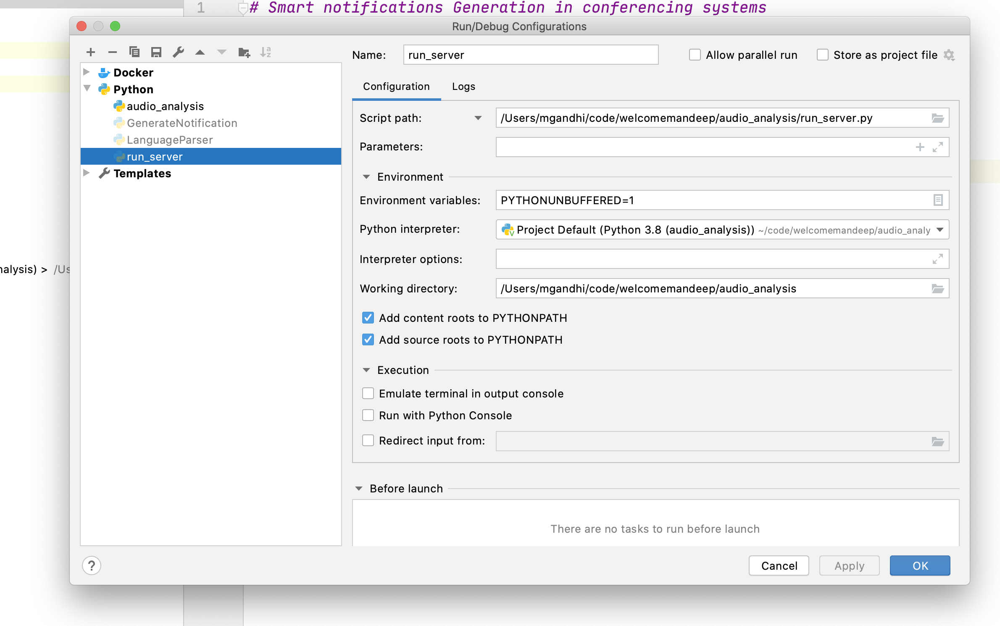

# Smart notifications Generation in conferencing systems

## Dependencies 
Use pip to install requirements for local development -

`pip -r requirements.txt`

## Deployment 
### Using Docker Compose

`docker-compose up --build`

### Commandline 

`python run_server.py`

### Using Intellij Idea 

Use the following configuration - 

## Development
Use Python [PEP8's](https://www.python.org/dev/peps/pep-0008/) for development.
